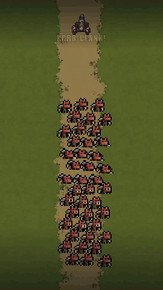

# Hero's Bounty YouTube Short — OpenAI Build-a-thon 2026

This project shows how I used Codex to turn a real gameplay moment from my Phaser game, Hero's Bounty, into a polished vertical YouTube Short with Remotion.

Codex helped me create a repeatable workflow for capturing a deterministic cannon attack, formatting it for a 1080 × 1920 canvas, iterating on timing in Remotion Studio, adding comic-book impact words, and rendering the finished video.

## Watch the Short

[](https://youtube.com/shorts/Lyd-eJqWnek)

Click the animated preview to watch the published YouTube Short.

## Videos

- **Published YouTube Short:** [Watch on YouTube](https://youtube.com/shorts/Lyd-eJqWnek)
- **Build-a-thon showcase:** [Watch the submission demo on Google Drive](https://drive.google.com/file/d/1iMHhBxcd0b7VUmiY0dgVdIwFhd_-SplL/view?usp=drive_link)
- **Rendered Short:** [Watch the full-quality MP4 on Google Drive](https://drive.google.com/file/d/1ysBwuku1fD4Yk-rzdyq0pV7LjnaJOepW/view?usp=drive_link)
- **Repository renders:** [`cannon-attack-short.mp4`](out/cannon-attack-short.mp4) · [`buildathon-showcase.mp4`](out/buildathon-showcase.mp4)
- **Raw gameplay capture:** [`public/video/cannon-attack-capture.mp4`](public/video/cannon-attack-capture.mp4)

## Run locally

Requires Node.js 20 or newer.

```bash
npm install
npm run preview
```

Open either composition in Remotion Studio:

- `CannonAttackShort` — the 11.6-second vertical video
- `BuildathonShowcase` — the 53-second submission walkthrough

## Render

```bash
npm run render:short
npm run render:showcase
```

Rendered videos are written to `out/`.

## Workflow

1. Capture the cannon attack from Hero's Bounty as portrait gameplay footage.
2. Load the capture into a frame-accurate Remotion composition.
3. Time comic action words to firing and impact moments.
4. Preview changes instantly in Remotion Studio.
5. Render the finished YouTube Short and build-a-thon presentation from code.

## Built with

- OpenAI Codex
- Remotion
- React and TypeScript
- Phaser gameplay footage from Hero's Bounty
